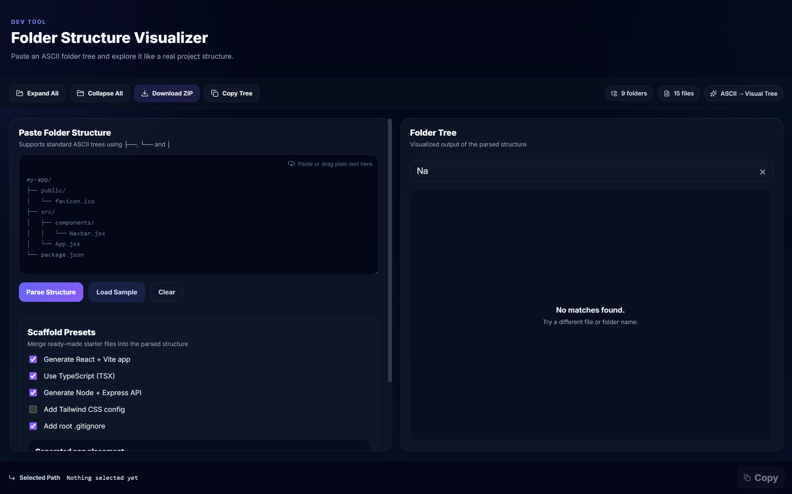

# 📁 Folder Structure Visualizer

**Folder Structure Visualizer** is a developer tool that converts ASCII folder trees into an interactive visual explorer and allows exporting the structure as a downloadable scaffold ZIP.

Instead of manually creating dozens of folders and files when starting a project, you can paste a tree structure and generate the entire scaffold instantly.

---

## ✨ Features

- **📂 ASCII → Visual Tree**
  Paste a standard ASCII folder tree and instantly visualize it.

- **🌳 Collapsible Folder Explorer**
  Expand or collapse folders like a real file explorer.

- **📊 File & Folder Counters**
  Automatically counts total files and directories.

- **📋 Copy Path**
  Click any file or folder and copy its full path.

- **📄 Copy Tree as Markdown**
  Export the folder structure as Markdown.

- **📦 Download Project Scaffold**
  Generate and download a ZIP containing the entire folder structure.

- **🚫 Smart Ignore Rules**
  Automatically filters out generated folders like
  `node_modules`, `dist`, `build`, `.next`, and `coverage`.

- **🖱 Drag & Drop Input**
  Drop ASCII trees directly into the editor.

- **😖 Supports both standard ASCII trees (├──, └──, │) and indentation-based structures.**
  Indentation is only valid under folders (lines ending with /).

---

## 🖼 Preview



### Input

```text
my-app/
├── public/
│   └── favicon.ico
├── src/
│   ├── components/
│   │   ├── Navbar.jsx
│   │   └── Footer.jsx
│   ├── pages/
│   │   └── HomePage.jsx
│   ├── App.jsx
│   └── main.jsx
├── package.json
└── README.md
```

### Result

This becomes an **interactive visual tree** inside the UI.

---

## 📦 Scaffold Export

The **Download ZIP** feature creates a project scaffold where the ZIP file is automatically named after your **root folder**.

> ⚠️ **Important**
> All files are generated as **empty files**, allowing developers to start coding immediately without manually creating folders and files.

---

## 🛠 Tech Stack

- **Framework:** React (Vite)
- **Language:** JavaScript
- **Styling:** CSS
- **Icons:** Lucide React & React Icons
- **ZIP Generation:** JSZip

---

## 🚀 Installation

Clone the repository:

```bash
git clone https://github.com/<your-username>/folder-structure-visualizer.git
```

Navigate into the project:

```bash
cd folder-structure-visualizer
```

Install dependencies:

```bash
npm install
```

Start the development server:

```bash
npm run dev
```

Open in browser:

```
http://localhost:5173
```

---

## 🧠 How It Works

1. **Input** – User pastes an ASCII folder tree.
2. **Parsing** – The parser converts the text into a nested JSON data structure.
3. **Visualization** – The UI renders the structure as a collapsible file explorer.
4. **Action** – The structure can then be:
   - copied as Markdown
   - explored visually
   - exported as a ZIP scaffold (ignoring build artifacts)

---

## 🎯 Use Cases

- **Quick Scaffolding** – Set up new projects in seconds.
- **Repo Visualization** – Understand complex repository structures instantly.
- **Architecture Sharing** – Share project designs with teammates.
- **Documentation** – Generate clean trees for README files.

---

## 🔮 Future Improvements

- [ ] VSCode-style tree guide lines
- [ ] Import folder structure directly from a GitHub URL
- [ ] Export structure as JSON
- [ ] User-defined custom ignore rules
- [ ] Dark/light theme toggle

---

## 📜 License

This project is licensed under the **MIT License**.

---

## 👨‍💻 Author

**Farhaan Khan**
Computer Science Engineering student passionate about building developer tools and learning through projects.

---

## ⭐ Support

If you found this project useful, consider **starring the repository** to support development!
